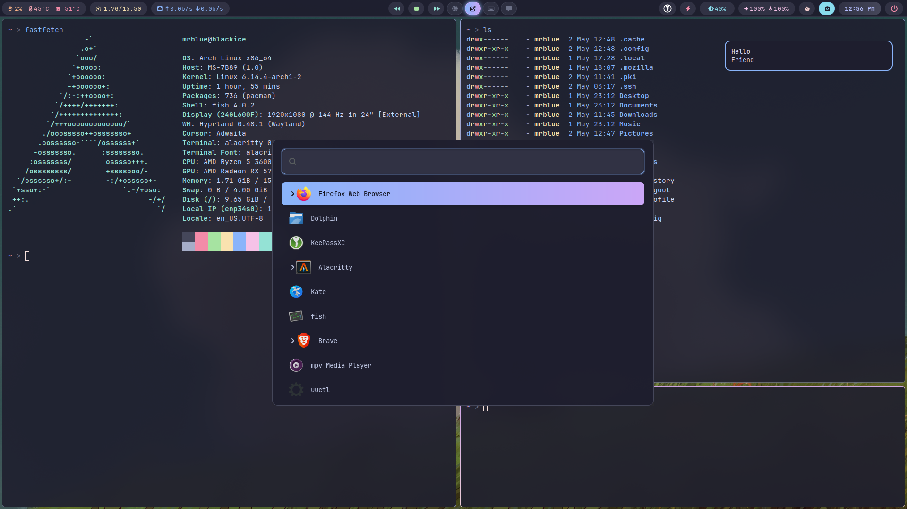

# My Hyprland Dotfiles

These are my personal configuration files for a Hyprland desktop environment setup on **Arch Linux**. The configuration aims for a clean look with blur effects and a keyboard-driven workflow, utilizing Waybar, Wofi, and Alacritty.



## Features

*   **Window Manager:** Hyprland (Tiling Wayland Compositor)
*   **Bar:** Waybar (Highly customizable)
*   **Launcher:** Wofi (Used for app launching and clipboard history)
*   **Terminal:** Alacritty
*   **File Manager:** Dolphin
*   **Notifications:** Dunst
*   **Keybindings:** Vim-like navigation (HJKL)
*   **Aesthetics:** Rounded corners, blur effects, custom Waybar modules.
*   **Screenshot:** Using grim and satty, window screenshot requires jq installed
*   **Utilities:** Includes configurations for clipboard history (**Cliphist** via Wofi), brightness control (laptop & DDC/CI via **ddcutil**/**i2c-dev**), media controls, power menu, **lm_sensors** temperature monitoring, etc.

## Installation (Arch Linux)

These instructions assume you are running Arch Linux or an Arch-based distribution.

0.  **Get a Minimal Arch Install:**
    Use archinstall to get a base arch minimal install
    ```bash
    archinstall hyprland
    ```

1.  **Clone the Repository:**
    Clone this repository to your local machine. For example:
    ```bash
    git clone https://github.com/swapnanil1/hypr-arch
    ```

2.  **Copy Configuration Files:**
    Copy the configuration directories into your `~/.config/` directory.
    ```bash
    # Example assuming you cloned to ~/dotfiles:
    cd repos/hypr-arch
    cp -rf * ~/.config/
    # Ensure other relevant config files (like for wofi) are also copied if they are part of your repo.
    ```

3.  **Install Dependencies:**
    Run the following command in your terminal to install all the necessary packages from the official Arch repositories.
    ```bash
    sudo pacman -Syu --needed uwsm hyprland waybar hyprpaper hyprlock alacritty dolphin sddm wofi wl-clipboard cliphist brightnessctl wireplumber playerctl  dunst hyprpolkitagent hyprcursor ddcutil xdg-desktop-portal-hyprland xdg-desktop-portal-gtk kservice qt6-wayland lm_sensors pavucontrol power-profiles-daemon grim satty 
    ```

4.  **Install Nerd Font:**
    The configuration relies heavily on icons provided by Nerd Fonts. JetBrainsMono Nerd Font is specified. Install it, preferably via the AUR:
    ```bash
    sudo pacman -S --needed ttf-jetbrains-mono-nerd otf-font-awesome
    fc-cache -fv
    ```
    If you don't have it in official repos, download it manually from the [Nerd Fonts website](https://www.nerdfonts.com/) and place it in `~/.local/share/fonts/`. and switch it inside config.

5.  **Configure DDC/CI Access:**
    For external monitor brightness control using `ddcutil`, your user needs permission to access I2C devices. Add your user to the `i2c-dev` group:
    ```bash
    echo "i2c-dev" | sudo tee -a /etc/modules-load.d/i2c-dev.conf
    sudo groupadd i2c
    sudo usermod -aG i2c-dev $USER
    ```
    You will need to **log out and log back in** for this group change to take effect. You might also need to load the `i2c-dev` kernel module (`sudo modprobe i2c-dev`) and potentially make it load on boot.

6.  **Configure Hardware Sensors:**
    Run `sudo sensors-detect` **as root** and follow the prompts (answering YES is usually safe, but read carefully) to allow `lm_sensors` to detect your hardware sensors for the temperature modules. A reboot might be required for kernel modules to load properly.

7.  **Custom Scripts:**
    Several Waybar modules and keybindings rely on custom scripts. Ensure the following scripts exist in the specified locations and are executable (`chmod +x <script_name>`):
    *   `~/.config/waybar/scripts/get_temps.sh` (Relies on `lm_sensors`)
    *   `~/.config/waybar/scripts/pomo.sh`
    *   `~/.config/waybar/scripts/ddc_brightness.sh` (Relies on `ddcutil` and `i2c-dev` access)
    *   `~/.config/waybar/scripts/mpris_status.sh`
    *   `~/.config/hypr/scripts/gamemode.sh`
    *   `~/.config/hypr/scripts/restart_waybar.sh`

8.  **Waybar Power Menu:**
    The power button in Waybar needs an XML file defining the menu structure. Create `~/.config/waybar/power_menu.xml`. An example structure is:
    ```xml
    <menu id="powermenu">
      <item id="shutdown" label="Shutdown"/>
      <item id="reboot" label="Reboot"/>
      <item id="suspend" label="Suspend"/>
      <separator/>
      <item id="lock" label="Lock Screen"/>
    </menu>
    ```

9.  **Enable Systemd Services:**
    Enable required services for power management and audio:
    ```bash
    sudo systemctl enable --now power-profiles-daemon.service
    systemctl --user enable --now wireplumber.service # For PipeWire audio session management
    systemctl --user enable --now dunst.service       # Enable Dunst notification daemon for user session
    ```

10. **Polkit Agent Autostart:**
    ```bash
    systemctl --user enable --now hyprpolkitagent
    ```
11. **Reboot or Restart Hyprland:**
    Log out and log back into your Hyprland session, or reboot your system for all changes to take effect, especially the group membership change for `i2c-dev`.

## Keybindings

The main modifier key (`$mainMod`) is set to `SUPER` (Windows/Command key).

Here are some common keybindings (refer to `~/.config/hypr/keybindings.conf` for the full list):

*   `$mainMod + Return`: Launch Terminal (`alacritty`)
*   `$mainMod + E`: Launch File Manager (`dolphin`)
*   `$mainMod + D`: Launch Application Menu (`wofi`)
*   `$mainMod + C`: Launch Code Editor (`code`)
*   `$mainMod + SHIFT + Q`: Kill active window
*   `$mainMod + SHIFT + C`: Exit Hyprland
*   `$mainMod + SHIFT + G`: GameMode
*   `$mainMod + F`: Toggle fullscreen
*   `$mainMod + Space`: Toggle floating window
*   `$mainMod + H/J/K/L`: Move focus left/down/up/right
*   `$mainMod + SHIFT + H/J/K/L`: Move window left/down/up/right
*   `$mainMod + [1-9]`: Switch to workspace 1-9
*   `$mainMod + SHIFT + [1-9]`: Move active window to workspace 1-9
*   `$mainMod + V`: Show clipboard history (Wofi + Cliphist)
*   `$mainMod + SHIFT + R`: Reload Hyprland config
*   `$mainMod + PageUp/PageDown`: Adjust DDC/CI monitor brightness (uses script)
*   `XF86AudioRaiseVolume/LowerVolume/Mute`: Volume controls
*   `XF86MonBrightnessUp/Down`: Laptop brightness controls
*   `XF86AudioPlay/Pause/Next/Prev`: Media controls

## Notes

*   These dotfiles are personalized. You may need to adjust paths, scripts, or settings to fit your specific hardware and preferences.
*   Ensure your custom scripts (`ddc_brightness.sh`, `get_temps.sh`, etc.) are working correctly and outputting the expected format (often JSON) for Waybar. Check script dependencies (`ddcutil`, `lm_sensors`).
*   **External brightness control requires the user to be in the `i2c-dev` group and potentially loading the `i2c-dev` kernel module.**
*   Font rendering and icons depend heavily on having the correct Nerd Font installed and specified in Waybar's `style.css`.

---
